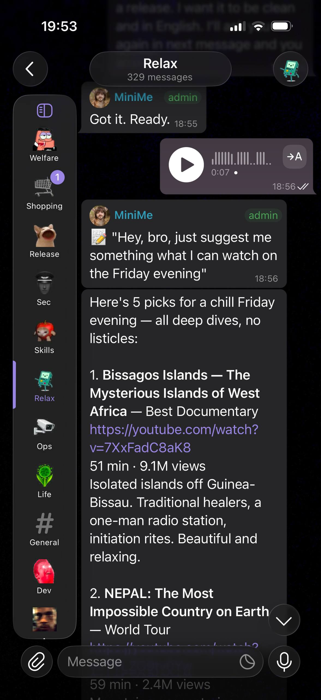
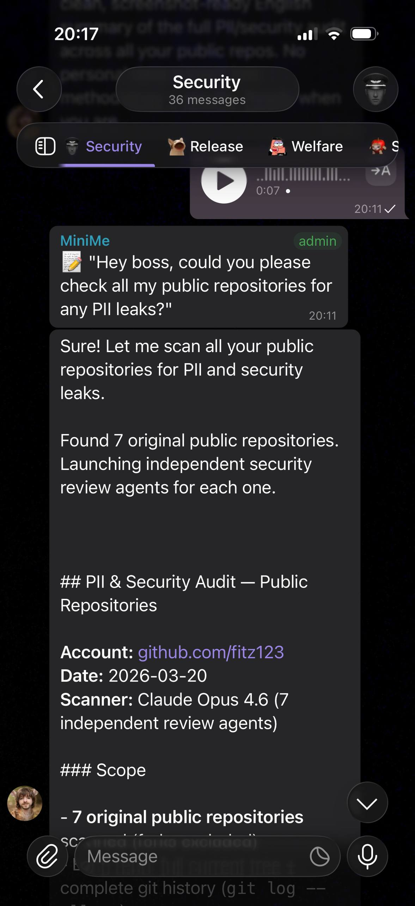

# Minime

Multi-platform bot (Telegram + Discord) that routes messages to Claude Code CLI subprocesses. Each chat/channel gets its own persistent Claude Code session. Runs on Max subscription (no API keys).

<p align="center">
  
  
</p>

## Architecture

```
Telegram Cloud          Discord Gateway
    │                        │
    ▼ (long polling)         ▼ (websocket)
┌────────────────┐    ┌────────────────┐
│  grammY Bot    │    │  Discord.js    │
│  telegram-bot  │    │  discord-bot   │
└───────┬────────┘    └───────┬────────┘
        │                     │
        ▼                     ▼
   ┌─────────────────────────────────┐
   │  Platform Context (interface)   │
   │  - sendMessage, editMessage     │
   │  - sendTyping, sendFile         │
   │  - per-binding streaming flags  │
   └───────────────┬─────────────────┘
                   │
                   ▼
         ┌──────────────────┐
         │  Message Queue   │
         │  - 3s debounce   │
         │  - mid-turn      │
         │    collect (20)  │
         └────────┬─────────┘
                  │
                  ▼
         ┌──────────────────┐
         │  Session Manager │
         │  - 1 per chat    │
         │  - LRU eviction  │
         │  - idle timeout  │
         │  - resume on     │
         │    respawn       │
         └────────┬─────────┘
                  │ spawns claude -p (stream-json)
                  ▼
         ┌──────────────────┐
         │  Claude Code CLI │
         │  - per-agent     │
         │    workspace     │
         │  - model from    │
         │    config        │
         └────────┬─────────┘
                  │
                  ▼
            Anthropic API
```

Both platforms share one Session Manager and use the same stream-relay logic via the `PlatformContext` interface. Each platform provides an adapter that handles platform-specific message I/O (Telegram: grammY Context, Discord: discord.js Channel).

**Message queue** sits between platform bots and Session Manager. Rapid messages are debounced (3s window) into a single prompt. Messages arriving while Claude is processing are collected (up to 20) and delivered as a combined followup after the current turn completes.

**Cron jobs** run separately via launchd plists. Each plist calls `run-cron.sh <task-name>`, which invokes `cron-runner.ts` to spawn a one-shot `claude -p` session with the cron's prompt.

**Config:** `config.yaml` defines agents (workspace + model) and bindings (chatId/channelId -> agentId). User-specific overrides live in `config.local.yaml` (gitignored, deep-merged over `config.yaml`). At least one platform (Telegram or Discord) must be configured. Tokens are read from macOS Keychain at runtime.

## Installation

### Prerequisites

- macOS (launchd required for bot service management)
- Node.js 20+ and npm
- `jq` — required by hook scripts (`brew install jq`)
- [Claude Code CLI](https://claude.ai/code) with Max subscription
- A Telegram bot token from [@BotFather](https://t.me/BotFather) (or Discord bot token)

### Steps

**1. Clone and install**

```bash
git clone https://github.com/fitz123/claude-code-bot.git ~/.minime
cd ~/.minime/bot && npm install
```

**2. Configure for your environment**

`config.yaml` ships with working defaults. Create `config.local.yaml` for your overrides:

```bash
cp config.local.yaml.example config.local.yaml
```

Edit `config.local.yaml` — set `workspaceCwd` to the absolute path of your repo and `chatId` to your Telegram user ID (send `/start` to [@userinfobot](https://t.me/userinfobot) to find it).

`crons.yaml` ships with example crons (all disabled). Create `crons.local.yaml` for your own crons:

```bash
cp crons.local.yaml.example crons.local.yaml
```

Create `.claude/settings.local.json` with required settings:

```json
{
  "outputStyle": "Your output style name",
  "autoMemoryEnabled": true,
  "autoMemoryDirectory": "/absolute/path/to/your/workspace/memory/auto"
}
```

**3. Store Telegram bot token in macOS Keychain**

```bash
security add-generic-password -s 'telegram-bot-token' -a 'minime' -w 'YOUR_TOKEN_HERE'
```

**4. Store Claude Code OAuth token in Keychain**

```bash
claude setup-token
# Copy the token, then store it:
security add-generic-password -s 'claude-code-oauth-token' -a 'minime' -w 'YOUR_OAUTH_TOKEN'
```

The bot reads this token at startup via `start-bot.sh` and `run-cron.sh` — it does not use `claude auth login`.

**5. Create launchd service**

```bash
mkdir -p ~/.minime/logs
cp bot/telegram-bot.plist.example ~/Library/LaunchAgents/ai.minime.telegram-bot.plist
```

Edit the plist — replace `WORKSPACE`, `LOG_DIR`, and `USER_HOME` with your paths.

**6. Validate and start**

```bash
cd ~/.minime && npx tsx bot/src/config.ts --validate
launchctl bootstrap gui/$(id -u) ~/Library/LaunchAgents/ai.minime.telegram-bot.plist
```

**7. Verify**

```bash
launchctl list | grep ai.minime.telegram-bot
tail -f ~/.minime/logs/telegram-bot.stdout.log
```

Send a message to your bot in Telegram to confirm it responds.

### Optional setup

**Discord:** Store token in Keychain (`security add-generic-password -s 'discord-bot-token' -a 'minime' -w 'TOKEN'`), add a `discord` section to `config.local.yaml`. See [config.yaml](config.yaml) for full reference.

**Crons:** Add your crons to `crons.local.yaml` (copy from `crons.local.yaml.example`), then generate and load plists:
```bash
cd ~/.minime/bot && npx tsx scripts/generate-plists.ts
launchctl bootstrap gui/$(id -u) ~/Library/LaunchAgents/ai.minime.cron.<name>.plist
```

**Optional rules:** `cp .claude/optional-rules/memory-protocol.md .claude/rules/custom/`

**ADR governance:** `mkdir -p reference/governance && cp reference/governance/decisions.md.example reference/governance/decisions.md`

## Start / Stop

The bot runs as a launchd service: `ai.minime.telegram-bot`.

```bash
# Check status
launchctl print gui/$(id -u)/ai.minime.telegram-bot 2>&1 | head -5

# Restart (graceful — waits for active sessions to finish)
launchctl kill SIGTERM gui/$(id -u)/ai.minime.telegram-bot

# Stop
launchctl bootout gui/$(id -u)/ai.minime.telegram-bot

# Start (if stopped)
launchctl bootstrap gui/$(id -u) ~/Library/LaunchAgents/ai.minime.telegram-bot.plist
```

**Warning:** Graceful restart sends SIGTERM — the bot injects a shutdown message into active sessions and waits up to 60s for turns to complete before exiting. Idle sessions close immediately. launchd auto-restarts via KeepAlive. Still, active work is interrupted — always confirm before restarting.

## Add a Cron

1. Edit `crons.local.yaml` — add a new entry:
   ```yaml
   - name: my-task
     schedule: "30 9 * * *"
     prompt: >
       Do the thing.
     agentId: main
     deliveryChatId: YOUR_CHAT_ID
   ```

   Cron field reference:

   | Field | Type | Required | Description |
   |-------|------|----------|-------------|
   | `name` | string | yes | Unique identifier for the cron job |
   | `schedule` | string | yes | 5-field cron expression, local timezone |
   | `type` | `"llm"` or `"script"` | no | `"llm"` (default) runs `claude -p`; `"script"` runs a shell command |
   | `prompt` | string | for llm | Prompt sent to Claude |
   | `command` | string | for script | Shell command to execute |
   | `agentId` | string | yes | Must match an agent in `config.yaml` or `config.local.yaml` |
   | `deliveryChatId` | number | no | Telegram chat ID for delivery (falls back to config default) |
   | `deliveryThreadId` | number | no | Telegram forum topic ID for delivery |
   | `timeout` | number | no | Per-cron timeout in ms (default: 300000 = 5 min) |
   | `enabled` | boolean | no | Set `false` to disable without deleting (default: `true`) |

2. Generate launchd plists:
   ```bash
   cd ~/.minime/bot && npx tsx scripts/generate-plists.ts
   ```

3. Load and test:
   ```bash
   launchctl bootstrap gui/$(id -u) ~/Library/LaunchAgents/ai.minime.cron.my-task.plist
   launchctl start ai.minime.cron.my-task
   tail -f ~/.minime/logs/cron-my-task.log
   ```

To remove: `launchctl bootout gui/$(id -u)/ai.minime.cron.<name>`, delete from `crons.local.yaml`, regenerate.

## Add a Binding

1. Add an agent and binding to `config.local.yaml`:
   ```yaml
   agents:
     new-agent:
       id: new-agent
       workspaceCwd: /Users/YOU/.minime/workspace-new
       model: claude-opus-4-6

   bindings:
     - chatId: 123456789
       agentId: new-agent
       kind: dm
       label: New Agent DM
   ```

   See [config.yaml](config.yaml) for all binding options including `requireMention`, `voiceTranscriptEcho`, `streamingUpdates`, `typingIndicator`, and per-topic overrides for forum supergroups.

2. Validate and restart:
   ```bash
   cd ~/.minime/bot && npx tsx src/config.ts --validate
   launchctl kill SIGTERM gui/$(id -u)/ai.minime.telegram-bot
   ```

## Add a Discord Binding

1. Store the Discord bot token in macOS Keychain:
   ```bash
   security add-generic-password -s 'discord-bot-token' -a 'minime' -w 'YOUR_TOKEN_HERE'
   ```

2. Add the `discord` section to `config.local.yaml`:
   ```yaml
   discord:
     tokenService: discord-bot-token
     bindings:
       - guildId: "9876543210"
         agentId: main
         kind: channel
         label: My Server
         requireMention: true
   ```

   See [config.yaml](config.yaml) for per-channel overrides and guild-wide defaults.

3. Required bot permissions/intents: Guilds, GuildMessages, MessageContent (privileged), DirectMessages. Slash commands (`/start`, `/reset`, `/status`) are registered per-guild on startup.

`telegramTokenService` is optional — the bot can run Discord-only.

## Configuration

### Logging

All log output uses structured format: `TIMESTAMP LEVEL [tag] message`.

| Setting | Type | Default | Description |
|---------|------|---------|-------------|
| `logLevel` (config.yaml) | string | `"info"` | Log verbosity: `debug`, `info`, `warn`, `error` |
| `LOG_LEVEL` (env var) | string | — | Overrides `logLevel` from config when set |

### Monitoring

When `metricsPort` is set in `config.yaml`, the bot exposes a Prometheus-compatible `/metrics` endpoint on `127.0.0.1` at that port.

```yaml
metricsPort: 9090
```

See [bot/src/metrics.ts](bot/src/metrics.ts) for the full list of exported metrics.

## Upgrading from config.yaml.example

Older versions shipped `config.yaml.example` which you copied to `config.yaml` (gitignored). The current version tracks `config.yaml` directly and uses `config.local.yaml` for user overrides.

If you have a local `config.yaml` from the old workflow, git will refuse to pull because the file is now tracked. Migrate before pulling:

```bash
# 1. Back up your current config
cp config.yaml config.local.yaml

# 2. Remove the untracked file so git can check out the new tracked version
rm config.yaml

# 3. Pull — git will restore config.yaml with upstream defaults
git pull

# 4. Edit config.local.yaml — keep only your overrides (workspaceCwd, chatId, tokens, bindings)
#    Remove anything that matches the upstream defaults in config.yaml
```

Your `config.local.yaml` is deep-merged over `config.yaml` at startup, so you only need to keep what differs from the defaults.

## Similar Projects

### Why this exists

Most Telegram bots for Claude use the [Agent SDK](https://platform.claude.com/docs/en/agent-sdk/overview), which requires API keys and falls under Anthropic's Commercial Terms. Anthropic [explicitly prohibits](https://code.claude.com/docs/en/legal-and-compliance) using Max/Pro subscription OAuth tokens through the Agent SDK:

> OAuth authentication (used with Free, Pro, and Max plans) is intended exclusively for Claude Code and Claude.ai. Using OAuth tokens in any other product, tool, or service -- including the Agent SDK -- is not permitted.

This bot spawns the original `claude -p` binary directly. Same CLI you run in your terminal. Max subscription, no API keys, no per-token billing.

### ToS compliance on Max subscription

| Project | Engine | Max-compliant |
|---------|--------|---------------|
| **claude-code-bot** (this) | CLI binary (`claude -p`) | Yes |
| [PleasePrompto/ductor](https://github.com/PleasePrompto/ductor) | CLI binary (subprocess) | Yes |
| [Anthropic Official Plugin](https://github.com/anthropics/claude-plugins-official) | MCP extension of active CC session | Yes |
| [RichardAtCT/claude-code-telegram](https://github.com/RichardAtCT/claude-code-telegram) | Agent SDK (`claude_agent_sdk`) | No |
| [earlyaidopters/claudeclaw](https://github.com/earlyaidopters/claudeclaw) | Agent SDK (`@anthropic-ai/claude-agent-sdk`) | No |
| [linuz90/claude-telegram-bot](https://github.com/linuz90/claude-telegram-bot) | Agent SDK (`@anthropic-ai/claude-agent-sdk`) | No |
| [NachoSEO/claudegram](https://github.com/NachoSEO/claudegram) | Agent SDK (`@anthropic-ai/claude-agent-sdk`) | No |
| [openclaw/openclaw](https://github.com/openclaw/openclaw) | Own agent runtime | No (API keys) |
| [qwibitai/nanoclaw](https://github.com/qwibitai/nanoclaw) | Claude Code in Docker | No (API keys) |
| [mtzanidakis/praktor](https://github.com/mtzanidakis/praktor) | Agent SDK in Docker | No (API keys) |
| [six-ddc/ccbot](https://github.com/six-ddc/ccbot) | tmux bridge (CLI in tmux) | Yes |
| [chenhg5/cc-connect](https://github.com/chenhg5/cc-connect) | Bridge/proxy | Depends on agent |

Four projects run the actual CLI binary on a Max subscription without API keys: this bot, ductor, ccbot, and the official plugin.

### vs Anthropic Official Plugin

The [official plugin](https://github.com/anthropics/claude-plugins-official) is an MCP server that adds Telegram tools to an already-running Claude Code session.

- Not a standalone bot. Requires an active Claude Code session on your computer. Close the lid and it stops
- No cron or scheduled tasks. No autonomous work while you're away
- Single session. No parallel workspaces, no multi-agent
- Supports group chats but not forum topic routing
- No workspace health management or memory consolidation

It's a remote control for your terminal session, not an autonomous bot.

### vs ccbot

[ccbot](https://github.com/six-ddc/ccbot) runs Claude Code inside tmux and bridges it to Telegram via two channels: JSONL transcript polling for content, and terminal scraping for interactive UI.

What ccbot does better: tool use visibility (which tool was called, what it returned), thinking content as expandable blockquotes, and interactive permission handling — approve or deny tool calls from Telegram via inline keyboard. These are real advantages that `claude -p` stream-json cannot provide today.

The trade-off is fragility. Hardcoded regex patterns match Claude Code's terminal UI text — prompt wordings, spinner characters, chrome separators. Any Claude Code TUI update can silently break detection. Input goes through `send_keys()` with empirical timing delays. Two polling loops (JSONL at 2s + terminal scrape at 1s per window) add overhead that scales linearly with sessions.

No cron system, no multi-agent, no workspace management, no Discord. Single-user remote control with excellent visibility into what Claude is doing.

### vs Ductor

[Ductor](https://github.com/PleasePrompto/ductor) is the closest alternative. Also spawns the CLI binary, also ToS-compliant, also supports forum topics.

| | **claude-code-bot** | **ductor** |
|---|---|---|
| Language | TypeScript (grammY) | Python (aiogram) |
| Codebase | ~3k LoC | ~150 modules |
| Forum topic sessions | Yes | Yes |
| Multi-agent with isolated workspaces | Yes | Yes |
| Cron system | launchd plists (per-cron process isolation) | In-process scheduler |
| Crash safety | Atomic JSON writes, launchd auto-restart | Atomic writes, in-flight turn tracking, process registry |
| Workspace health | Filesystem guardian hooks + structural audits | Agent health with exponential backoff |
| Memory consolidation | Nightly summarization cron | File sync |
| Platforms | Telegram + Discord | Telegram + Matrix |
| Multi-CLI support | Claude Code | Claude Code, Codex, Gemini |

Neither project is strictly better than the other — feature sets are comparable. Ductor covers more CLIs and has deeper crash recovery (in-flight turn tracking, process registry, stream coalescing). We're significantly simpler: a thin TypeScript wrapper around `claude -p` that delegates complexity to the OS (launchd for process isolation, filesystem hooks for workspace protection) rather than reimplementing it in application code.
